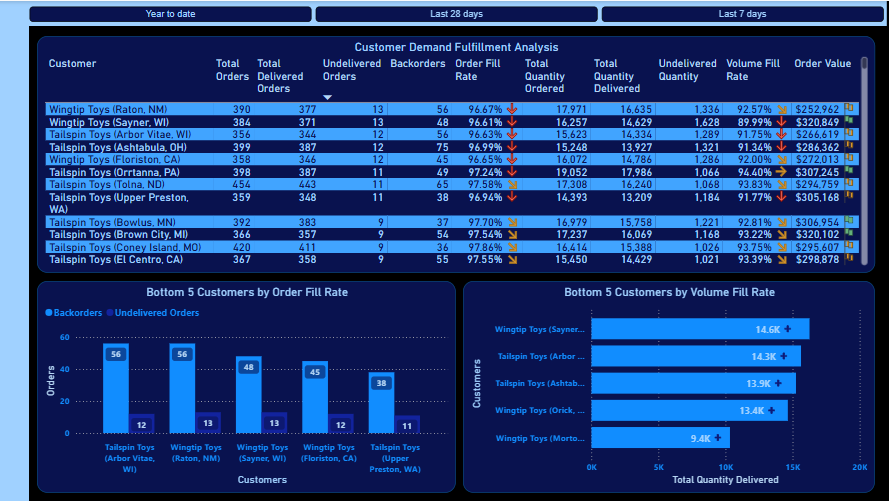
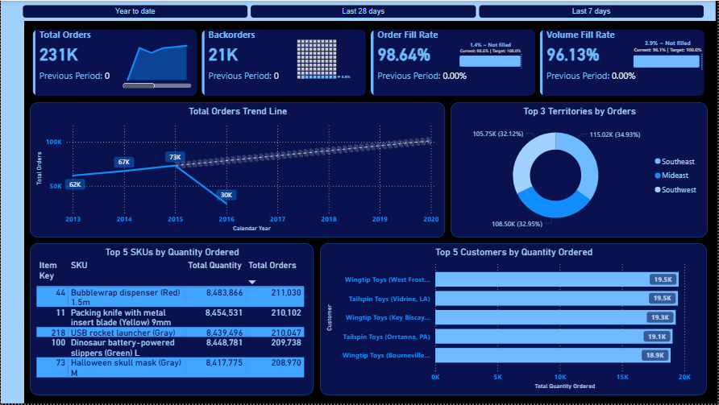

# Customer Demand Fulfillment & Operations Dashboard (Power BI)

## Overview

This Power BI report provides a comprehensive analysis of **customer demand fulfillment, operational efficiency, and order performance**. It enables stakeholders to monitor key KPIs, identify bottlenecks, and optimize supply chain and delivery processes.

The dashboard is designed for **business operations teams, sales leadership, and supply chain managers** to make data-driven decisions.

---

## Key Features

### Customer Demand Fulfillment Analysis

* Tracks **Total Orders, Delivered Orders, and Undelivered Orders**
* Highlights **Backorders and Order Fill Rate (%)**
* Monitors:

  * **Volume Fill Rate**
  * **Order Value**
* Identifies **low-performing customers** based on fulfillment metrics

---

### Executive Summary Dashboard

* High-level KPIs:

  * **Total Orders**
  * **Backorders**
  * **Order Fill Rate**
  * **Volume Fill Rate**
* Includes **trend analysis** over time
* Visual breakdown of:

  * **Top Territories by Orders**
  * **Top Customers & SKUs**

---

### Performance Insights

* **Bottom 5 Customers by Order Fill Rate**
* **Bottom 5 Customers by Volume Fill Rate**
* Helps quickly identify:

  * Fulfillment inefficiencies
  * Customer-level delivery issues

---

### Product & Customer Analytics

* **Top 5 SKUs by Quantity Ordered**
* **Top 5 Customers by Quantity Ordered**
* Enables:

  * Demand trend identification
  * Inventory planning insights

---

## Dashboard Snapshots

### Customer Demand Fulfillment Analysis

---

### Executive Dashboard Overview

---

## Tech Stack

* **Power BI**
* **DAX (Data Analysis Expressions)**
* **Data Modeling**
* **Data Sources**: (SQL Server)

---

## Key Insights Delivered

* Improved visibility into **order fulfillment performance**
* Identification of **high backorder customers**
* Monitoring of **regional demand distribution**
* Data-driven support for **inventory and logistics decisions**

---

## Business Impact

* Enhanced **operational efficiency**
* Reduced **order fulfillment gaps**
* Improved **customer satisfaction**
* Enabled proactive **decision-making**

---
